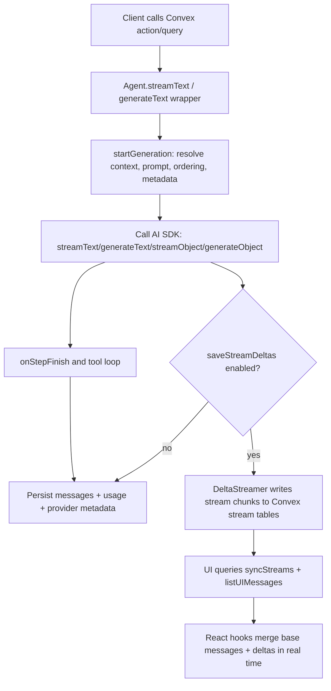

# AI SDK Flow in This Repository

This document explains how AI SDK calls flow through `@convex-dev/agent`.

## High-level flow

## Concrete sequence for `streamText`

1. A server function invokes `agent.streamText(...)`.
2. The wrapper prepares prompt/context/thread ordering via `startGeneration(...)`.
3. It invokes AI SDK `streamText(...)` with adjusted args and lifecycle callbacks.
4. As steps complete, messages are saved (or deferred for atomic finalization).
5. If `saveStreamDeltas` is set, a `DeltaStreamer` persists incremental chunks.
6. The caller may:
   - await full completion,
   - iterate `textStream`, or
   - return a streaming HTTP response.
7. Client queries call `syncStreams(...)` and combine deltas with stored messages.

## Why this wrapper exists

The AI SDK alone gives great stream primitives, but this package adds:

- durable thread/message storage,
- resumable/replayable streaming across reconnects,
- Convex-native querying/subscriptions for collaborative realtime UI,
- integrated usage/context tooling around agents.

## Related implementation hotspots

- `src/client/index.ts` (Agent class and exports)
- `src/client/streamText.ts` (stream wrapper + delta persistence)
- `src/client/start.ts` (generation bootstrap)
- `src/client/streaming.ts` (DeltaStreamer and stream sync helpers)
- `src/component/schema.ts` + `src/component/streams.ts` (stream tables + mutations/queries)
