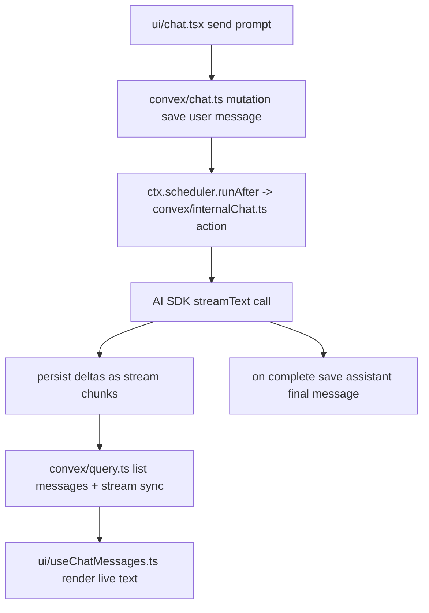

# Manual Setup: AI SDK + Convex + Persistent Streaming (Without importing all of `@convex-dev/agent`)

This guide is for your exact goal: **use only what you need** in another repo:

- Vercel AI SDK
- Convex
- persistent streaming pattern (similar to `persistent-text-streaming`)
- chat message storage in Convex

> Important: this repo (`@convex-dev/agent`) implements persistent streaming
> internally via `streamingMessages` + `streamDeltas` + `DeltaStreamer`. If you
> use Convex's standalone `persistent-text-streaming` component in your own
> app, keep the same architecture below; only the streaming adapter calls change.

---

## 1) Flow you should implement (file-by-file)



### Why this split is recommended

- Mutation creates a durable user message immediately (good UX + optimistic UI).
- Action handles long-running model stream.
- Query merges stable history + in-flight stream chunks.
- UI remains reactive through Convex subscriptions.

---

## 2) Minimal backend schema (your repo)

**File: `convex/schema.ts`**

```ts
import { defineSchema, defineTable } from "convex/server";
import { v } from "convex/values";

export default defineSchema({
  threads: defineTable({
    userId: v.optional(v.string()),
    title: v.optional(v.string()),
    createdAt: v.number(),
  }).index("by_user", ["userId"]),

  messages: defineTable({
    threadId: v.id("threads"),
    role: v.union(v.literal("user"), v.literal("assistant"), v.literal("system")),
    text: v.string(),
    order: v.number(),
    status: v.union(v.literal("complete"), v.literal("streaming"), v.literal("failed")),
    createdAt: v.number(),
  }).index("by_thread_order", ["threadId", "order"]),

  // Equivalent shape to persistent streaming internals
  streamingMessages: defineTable({
    threadId: v.id("threads"),
    order: v.number(),
    status: v.union(v.literal("streaming"), v.literal("finished"), v.literal("aborted")),
    createdAt: v.number(),
    updatedAt: v.number(),
  }).index("by_thread_status_order", ["threadId", "status", "order"]),

  streamDeltas: defineTable({
    streamId: v.id("streamingMessages"),
    start: v.number(),
    end: v.number(),
    text: v.string(),
  }).index("by_stream_start", ["streamId", "start"]),
});
```

---

## 3) Save prompt first, stream async second

**File: `convex/chat.ts`**

```ts
import { mutation } from "./_generated/server";
import { internal } from "./_generated/api";
import { v } from "convex/values";

export const sendMessage = mutation({
  args: {
    threadId: v.id("threads"),
    prompt: v.string(),
  },
  handler: async (ctx, { threadId, prompt }) => {
    const last = await ctx.db
      .query("messages")
      .withIndex("by_thread_order", (q) => q.eq("threadId", threadId))
      .order("desc")
      .first();

    const nextOrder = (last?.order ?? -1) + 1;

    await ctx.db.insert("messages", {
      threadId,
      role: "user",
      text: prompt,
      order: nextOrder,
      status: "complete",
      createdAt: Date.now(),
    });

    // async model generation
    await ctx.scheduler.runAfter(0, internal.internalChat.streamAssistant, {
      threadId,
      prompt,
      order: nextOrder + 1,
    });
  },
});
```

---

## 4) Stream using AI SDK + persist deltas

**File: `convex/internalChat.ts`**

```ts
import { internalAction } from "./_generated/server";
import { v } from "convex/values";
import { streamText } from "ai";
import { openai } from "@ai-sdk/openai";
import { internal } from "./_generated/api";

export const streamAssistant = internalAction({
  args: {
    threadId: v.id("threads"),
    prompt: v.string(),
    order: v.number(),
  },
  handler: async (ctx, { threadId, prompt, order }) => {
    const streamId = await ctx.runMutation(internal.streaming.createStream, {
      threadId,
      order,
    });

    let fullText = "";
    let cursor = 0;

    try {
      const result = streamText({
        model: openai("gpt-4o-mini"),
        prompt,
      });

      for await (const chunk of result.textStream) {
        fullText += chunk;

        // debounce/chunk however you want in production
        const start = cursor;
        const end = cursor + chunk.length;
        cursor = end;

        await ctx.runMutation(internal.streaming.addDelta, {
          streamId,
          start,
          end,
          text: chunk,
        });
      }

      await ctx.runMutation(internal.streaming.finishStream, { streamId });

      await ctx.runMutation(internal.streaming.saveFinalAssistantMessage, {
        threadId,
        order,
        text: fullText,
      });
    } catch (err) {
      await ctx.runMutation(internal.streaming.abortStream, {
        streamId,
        reason: err instanceof Error ? err.message : String(err),
      });
      throw err;
    }
  },
});
```

---

## 5) Streaming mutations + read query

**File: `convex/streaming.ts`**

```ts
import { internalMutation, query } from "./_generated/server";
import { v } from "convex/values";

export const createStream = internalMutation({
  args: { threadId: v.id("threads"), order: v.number() },
  handler: async (ctx, { threadId, order }) => {
    return await ctx.db.insert("streamingMessages", {
      threadId,
      order,
      status: "streaming",
      createdAt: Date.now(),
      updatedAt: Date.now(),
    });
  },
});

export const addDelta = internalMutation({
  args: {
    streamId: v.id("streamingMessages"),
    start: v.number(),
    end: v.number(),
    text: v.string(),
  },
  handler: async (ctx, args) => {
    await ctx.db.insert("streamDeltas", args);
    await ctx.db.patch(args.streamId, { updatedAt: Date.now() });
  },
});

export const finishStream = internalMutation({
  args: { streamId: v.id("streamingMessages") },
  handler: async (ctx, { streamId }) => {
    await ctx.db.patch(streamId, { status: "finished", updatedAt: Date.now() });
  },
});

export const abortStream = internalMutation({
  args: { streamId: v.id("streamingMessages"), reason: v.string() },
  handler: async (ctx, { streamId }) => {
    await ctx.db.patch(streamId, { status: "aborted", updatedAt: Date.now() });
  },
});

export const saveFinalAssistantMessage = internalMutation({
  args: {
    threadId: v.id("threads"),
    order: v.number(),
    text: v.string(),
  },
  handler: async (ctx, { threadId, order, text }) => {
    await ctx.db.insert("messages", {
      threadId,
      role: "assistant",
      text,
      order,
      status: "complete",
      createdAt: Date.now(),
    });
  },
});

export const listMessagesWithStreams = query({
  args: { threadId: v.id("threads") },
  handler: async (ctx, { threadId }) => {
    const messages = await ctx.db
      .query("messages")
      .withIndex("by_thread_order", (q) => q.eq("threadId", threadId))
      .collect();

    const activeStreams = await ctx.db
      .query("streamingMessages")
      .withIndex("by_thread_status_order", (q) =>
        q.eq("threadId", threadId).eq("status", "streaming"),
      )
      .collect();

    const streamDeltas = await Promise.all(
      activeStreams.map(async (s) => {
        const deltas = await ctx.db
          .query("streamDeltas")
          .withIndex("by_stream_start", (q) => q.eq("streamId", s._id))
          .collect();
        return {
          streamId: s._id,
          order: s.order,
          text: deltas.sort((a, b) => a.start - b.start).map((d) => d.text).join(""),
        };
      }),
    );

    return { messages, streamDeltas };
  },
});
```

---

## 6) Frontend query subscription

**File: `src/hooks/useChatMessages.ts`**

```ts
import { useQuery } from "convex/react";
import { api } from "../convex/_generated/api";

export function useChatMessages(threadId: string) {
  const data = useQuery(api.streaming.listMessagesWithStreams, {
    threadId: threadId as any,
  });

  if (!data) return [];

  const byOrder = new Map<number, { role: string; text: string; streaming?: boolean }>();

  for (const m of data.messages) {
    byOrder.set(m.order, { role: m.role, text: m.text, streaming: false });
  }

  for (const s of data.streamDeltas) {
    byOrder.set(s.order, { role: "assistant", text: s.text, streaming: true });
  }

  return [...byOrder.entries()]
    .sort((a, b) => a[0] - b[0])
    .map(([, value]) => value);
}
```

---

## 7) How this maps to THIS repo’s real files

If you want proven implementations to copy from this repo:

- Server streaming orchestration:
  - `example/convex/chat/streaming.ts`
- Low-level streaming primitives:
  - `src/client/streaming.ts` (`DeltaStreamer`, `syncStreams`)
- Stream schema/tables:
  - `src/component/schema.ts` (`streamingMessages`, `streamDeltas`)
- Stream table operations:
  - `src/component/streams.ts`
- UI live rendering pattern:
  - `example/ui/chat/ChatStreaming.tsx`

---

## 8) If you use Convex `persistent-text-streaming` component directly

Use the same architecture above, but replace this guide's manual `streaming.ts`
mutations with the component's API calls from the latest docs.

In practice you still need:

1. Save prompt message immediately.
2. Start async AI SDK `streamText` action.
3. Push chunks to persistent stream storage.
4. Query + subscribe + merge base messages with in-flight stream text.
5. On completion, save final assistant message and mark stream done.

This gives you reliable chat UX without importing the full Agent component.
